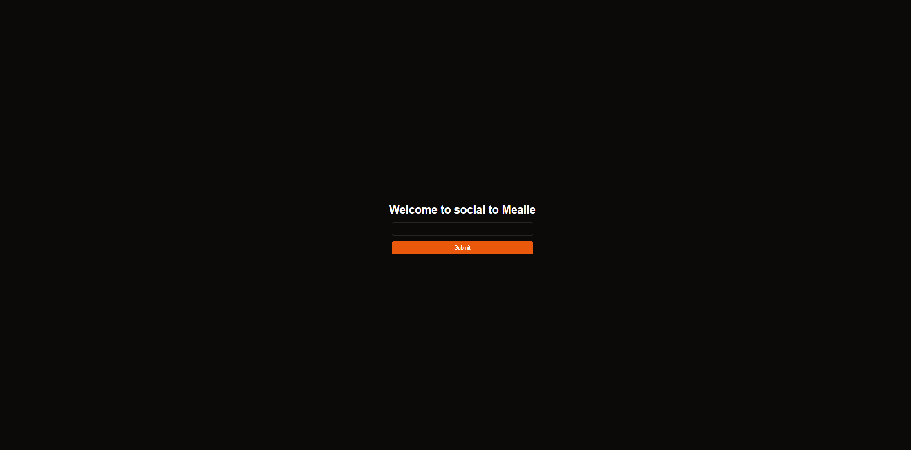

# Social media to Mealie

Found any recipe on a social media and don't want to manually write it yourself? use our tool to import any video from them in Mealie.
For now only works with Instagram,TikTok and Pinterest (without cover image) but will add more if you open an issue.

## Deployment

To deploy this just use the docker-compose.yml and populate all the environment variables

## Features

-   Import post from Instagram and TikTok in Mealie with a link and the click of a button
-   Use this [ios shortcut](https://www.icloud.com/shortcuts/a66a809029904151a39d8d3b98fecae4) so you just need to click share button

## Roadmap

You can check the roadmap at the [projects tab](https://github.com/users/GerardPolloRebozado/projects/8)

## Screenshot

